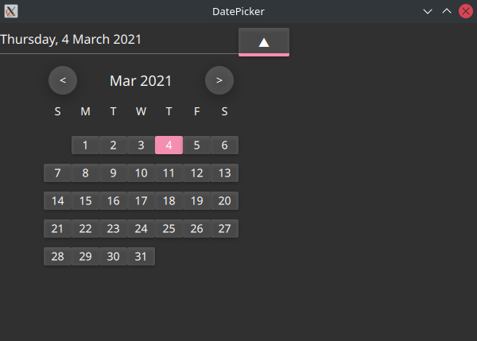

# qml-date-picker
Simple but function date picker in QML

# Preview


# Usage
```qml
import QtQuick 2.12
import QtQuick.Controls 2.12


ApplicationWindow {
    visible: true
    width: 600
    height: 400

    DateField {
        selected_date: new Date('2021/03/04')
        format: 'dd MMMM yyyy'
    }
}
```
